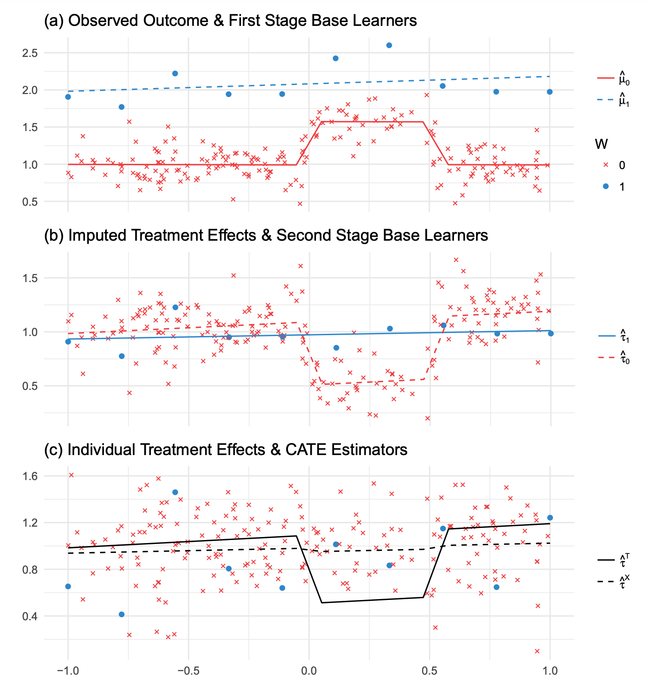
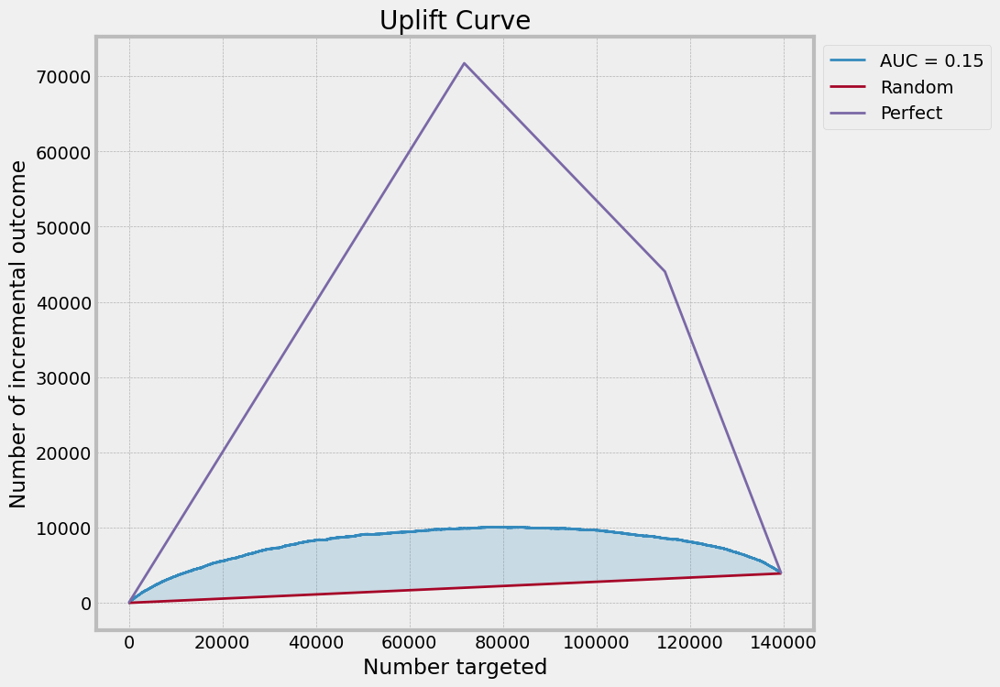

# Introduction to Uplift Modeling

## [Dr. Juan Orduz](https://juanitorduz.github.io/)


[PyConDE & PyData Berlin 2022](https://2022.pycon.de/)


---
<!--
_footer: Image taken from https://www.uplift-modeling.com/en/latest/user_guide/introduction/clients.html 
-->

# Motivation

## How can we optimally select customers to be treated by marketing incentives?


---

# We can not **send** and **not send** incentives to the same customers at the same time


---

# What is Uplift Modeling?

From [Gutierrez, P., & Gérardy, J. Y. (2017). "Causal Inference and Uplift Modelling: A Review of the Literature"](https://proceedings.mlr.press/v67/gutierrez17a/gutierrez17a.pdf)

 > - Uplift modeling refers to the set of techniques used to model the incremental impact of an action or treatment on a customer outcome.
 > - Uplift modeling is therefore both a Causal Inference problem and a Machine Learning one. 
 
---
<!--
_footer: Taken from [Gutierrez, P., & Gérardy, J. Y. (2017). "Causal Inference and Uplift Modelling: A Review of the Literature"](https://proceedings.mlr.press/v67/gutierrez17a/gutierrez17a.pdf)
-->

# Conditional Average Treatment Effect

- Let $Y^{1}_{i}$ denote person $i$'s outcome when it receives the treatment and $Y^{0}_{i}$ when it does not receive the treatment.
- We are interested in understanding the *causal effect* $Y^{1}_{i} - Y^{0}_{i}$ and the  *conditional average treatment effect* $CATE = E[Y^{1}_{i} | X_{i}] - E[Y^{0}_{i} | X_{i}]$, where $X_{i}$ is a feature vector of the $i$-th person.
- **However, we can not observe them!** 🙁 

---
<!--
_footer: Taken from [Gutierrez, P., & Gérardy, J. Y. (2017). "Causal Inference and Uplift Modelling: A Review of the Literature"](https://proceedings.mlr.press/v67/gutierrez17a/gutierrez17a.pdf)
-->
# Uplift

Let $W_{i}$ is a binary variable indicating whether person $i$ received the treatment, so that

$$Y_{i}^{obs} = Y^{1}_{i} W_{i} + (1 - W_{i}) Y^{0}_{i}$$

## Unconfoundedness Assumption

If we **assume** that the treatment assignment $W_{i}$ is independent of $Y^{1}_{i}$  and $Y^{0}_{i}$ conditional on $X_i$, then we can estimate the $CATE$ from observational data by computing the empirical counterpart:

$$\text{\bf{uplift}} = \widehat{CATE} = E[Y_{i} | X_{i}, W_{i}=1] - E[Y_{i} | X_{i}, W_{i}=0]$$

---

# Estimating Uplift

- Meta algorithms

- Direct measurements (trees)

---

# Some python implementations

- [`causalml`](https://github.com/uber/causalml)


- [`EconML`](https://github.com/microsoft/EconML)


- [`scikit-uplift`](https://github.com/maks-sh/scikit-uplift)


---

# S-Learner
<!--
_footer: Taken from https://www.uplift-modeling.com/en/latest/user_guide/models/index.html
-->

### Step 1: Training

$$
\underbrace{
\left(
\begin{array}{cccc}
x_{11} & \cdots & x_{1k} & w_{1} \\
\vdots & \ddots & \vdots & \vdots \\
x_{11} & \cdots & x_{nk} & w_{n} \\
\end{array}
\right)}_{X\bigoplus W}
\xrightarrow{\mu}
\left(
\begin{array}{c}
y_{1} \\
\vdots \\
y_{n}
\end{array}
\right)
$$

### Step 2: Uplift Prediction

$$
\widehat{\text{\bf{uplift}}} = 
\hat{\mu}\left(
\begin{array}{cccc}
x_{11} & \cdots & x_{1k} & 1 \\
\vdots & \ddots & \vdots & \vdots \\
x_{11} & \cdots & x_{mk} & 1 \\
\end{array}
\right)
-
\hat{\mu}
\left(
\begin{array}{cccc}
x_{11} & \cdots & x_{1k} & 0 \\
\vdots & \ddots & \vdots & \vdots \\
x_{11} & \cdots & x_{mk} & 0 \\
\end{array}
\right)
$$

---
<!--
_footer: Taken from https://causalml.readthedocs.io/en/latest/methodology.html#meta-learner-algorithms
-->

# T-Learner

### Step 1: Training

$$
\underbrace{
\left(
\begin{array}{ccc}
x_{11} & \cdots & x_{1k} \\
\vdots & \ddots & \vdots \\
x_{11} & \cdots & x_{n_{C}k} \\
\end{array}
\right)}_{X|_{\text{control}}}
\xrightarrow{\mu_{C}}
\left(
\begin{array}{c}
y_{1} \\
\vdots \\
y_{n_{C}}
\end{array}
\right)
$$

$$
\underbrace{
\left(
\begin{array}{ccc}
x_{11} & \cdots & x_{1k}  \\
\vdots & \ddots & \vdots \\
x_{11} & \cdots & x_{n_{T}k} \\
\end{array}
\right)}_{X |_{\text{treatment}}}
\xrightarrow{\mu_{T}}
\left(
\begin{array}{c}
y_{1} \\
\vdots \\
y_{n_{T}}
\end{array}
\right) 
$$

---
<!--
_footer: Taken from https://causalml.readthedocs.io/en/latest/methodology.html#meta-learner-algorithms
-->

# T-Learner

### Step 2: Uplift Prediction

$$
\widehat{\text{\bf{uplift}}} = 
\hat{\mu}_{T}\left(
\begin{array}{cccc}
x_{11} & \cdots & x_{1k} \\
\vdots & \ddots & \vdots \\
x_{11} & \cdots & x_{mk} \\
\end{array}
\right)
-
\hat{\mu}_{C}
\left(
\begin{array}{cccc}
x_{11} & \cdots & x_{1k} \\
\vdots & \ddots & \vdots \\
x_{11} & \cdots & x_{mk} \\
\end{array}
\right)
$$

---
<!--
_footer: Taken from https://causalml.readthedocs.io/en/latest/methodology.html#meta-learner-algorithms
-->

# X-Learner

### Step 1: Training: Same as T-Learner

### Step 2: Compute imputed treatment effects

$$
\tilde{D}^{T} \coloneqq
\left(
\begin{array}{c}
y_{1} \\
\vdots \\
y_{n_{T}}
\end{array}
\right)
- 
\hat{\mu}_{C}
\left(
\begin{array}{cccc}
x_{11} & \cdots & x_{1k} \\
\vdots & \ddots & \vdots \\
x_{11} & \cdots & x_{n_{T}k} \\
\end{array}
\right)
$$

$$
\tilde{D}^{C} \coloneqq
\hat{\mu}_{T}
\left(
\begin{array}{cccc}
x_{11} & \cdots & x_{1k} \\
\vdots & \ddots & \vdots \\
x_{11} & \cdots & x_{n_{C}k} \\
\end{array}
\right)
-
\left(
\begin{array}{c}
y_{1} \\
\vdots \\
y_{n_{C}}
\end{array}
\right)
$$

---
<!--
_footer: Taken from https://causalml.readthedocs.io/en/latest/methodology.html#meta-learner-algorithms
-->

# X-Learner

### Step 3: Train with different targets

$$
\underbrace{
\left(
\begin{array}{ccc}
x_{11} & \cdots & x_{1k} \\
\vdots & \ddots & \vdots \\
x_{11} & \cdots & x_{n_{C}k} \\
\end{array}
\right)}_{X|_{\text{control}}}
\xrightarrow{\tau_{C}}
\left(
\begin{array}{c}
\tilde{D}^{C}_{1} \\
\vdots \\
\tilde{D}^{C}_{n_{T}}
\end{array}
\right)
$$

$$
\underbrace{
\left(
\begin{array}{ccc}
x_{11} & \cdots & x_{1k} \\
\vdots & \ddots & \vdots \\
x_{11} & \cdots & x_{n_{C}k} \\
\end{array}
\right)}_{X|_{\text{treatment}}}
\xrightarrow{\tau_{T}}
\left(
\begin{array}{c}
\tilde{D}^{T}_{1} \\
\vdots \\
\tilde{D}^{T}_{n_{T}}
\end{array}
\right)
$$

---
<!--
_footer: Taken from https://causalml.readthedocs.io/en/latest/methodology.html#meta-learner-algorithms
-->

# X-Learner

### Step 4: Uplift Prediction

$$
\widehat{\text{\bf{uplift}}} = g(x)\hat{\tau}_{C}(x) + (1 - g(x))\hat{\tau}_{T}(x)
$$

where $g(x) \in [0, 1]$ is a weight function.

---
<!--
_footer: Taken from [Sören, R, et.al. (2019) "Meta-learners for Estimating Heterogeneous Treatment Effects using Machine Learning"](https://arxiv.org/abs/1706.03461)
-->

# Intuition behind the X-Learner



---

# Python code: Example

```python
from causalml.inference.meta import BaseTClassifier
from sklearn.ensemble import HistGradientBoostingClassifier

# define ml model
learner = HistGradientBoostingClassifier()

# set meta-model
t_learner = BaseTClassifier(learner=learner)

# compute ate
t_ate_lwr, t_ate, t_ate_upr = t_learner.estimate_ate(X=x, treatment=w, y=y)

# predict treatment effects
t_learnet.predict(X=x)

# access ml models
t_learner.models_c[1]
t_learner.models_t[1]
```

---
<!--
_footer: Taken from [Gutierrez, P., & Gérardy, J. Y. (2017). "Causal Inference and Uplift Modelling: A Review of the Literature"](https://proceedings.mlr.press/v67/gutierrez17a/gutierrez17a.pdf)
-->

# Uplift Metrics: Cumulative gain chart

*Predict uplift for both treated and control observations and compute the average prediction per decile (bins) in both groups. Then, the difference between those averages is taken for each decile.*

$$
\left(
\frac{Y^{T}}{N^{T}}
-
\frac{Y^{C}}{N^{C}}
\right)
(N^{T} + N^{C})
$$

- $Y^{T} / Y^{C}$: sum of the treated / control individual outcomes  in the bin.
- $N^{T} / N^{C}$: number of treated / control observations  in the bin.

---
<!--
_footer: Plot function from [`scikit-uplift`](https://github.com/maks-sh/scikit-uplift)
-->

# Uplift Metrics: Cumulative gain chart


---
<!--
_footer: Taken from [Gutierrez, P., & Gérardy, J. Y. (2017). "Causal Inference and Uplift Modelling: A Review of the Literature"](https://proceedings.mlr.press/v67/gutierrez17a/gutierrez17a.pdf)
-->

# Uplift Metrics: Uplift Curve

*We can generalize the cumulative gain chart for each observation of the test set:*

$$
f(t)
=
\left(
\frac{Y^{T}_{t}}{N^{T}_{t}}
-
\frac{Y^{C}_{t}}{N^{C}_{t}}
\right)
(N^{T}_{t} + N^{C}_{t})
$$

*where the $t$ subscript indicates that the quantity is calculated for the first $t$ observations, sorted by inferred uplift value.*

---
<!--
_footer: Plot function from [`scikit-uplift`](https://github.com/maks-sh/scikit-uplift)
-->
# Uplift Metrics: Uplift Curve



---
<!--
_footer: Taken from https://www.uplift-modeling.com/en/latest/user_guide/introduction/data_collection.html
-->
# Data Collection


---
<!--
_footer: See https://juanitorduz.github.io/uplift/
-->
# Demo 
## [Notebook Link](https://juanitorduz.github.io/uplift/)

---

## References:

- [Gutierrez, P., & Gérardy, J. Y. (2017). "Causal Inference and Uplift Modelling: A Review of the Literature"](https://proceedings.mlr.press/v67/gutierrez17a/gutierrez17a.pdf)

- [Karlsson, H. (2019) "Uplift Modeling: Identifying Optimal Treatment Group Allocation and Whom to Contact to Maximize Return on Investment"](http://www.diva-portal.org/smash/get/diva2:1328437/FULLTEXT01.pdf)

- [Sören, R, et.al. (2019) "Meta-learners for Estimating Heterogeneous Treatment Effects using Machine Learning"](https://arxiv.org/abs/1706.03461)

---

# Thank you!

## More Info: [juanitorduz.github.io/](https://juanitorduz.github.io/)


