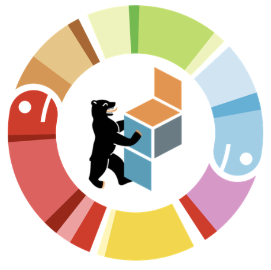

# Introduction to Uplift Modeling

## [Dr. Juan Orduz](https://juanitorduz.github.io/)

[PyConDE & PyData Berlin 2022](https://2022.pycon.de/)

---
<!--
    footer: Image taken from https://www.uplift-modeling.com/en/latest/user_guide/introduction/clients.html 
-->

# Motivation

## How can we optimally select customers to be treated by marketing incentives?

---
<!--
    footer: ""
-->

# We can not **send** and **not send** incentives to the same customers at the same time

---

# What is Uplift Modeling?

From [Gutierrez, P., & Gérardy, J. Y. (2017). "Causal Inference and Uplift Modelling: A Review of the Literature"](https://proceedings.mlr.press/v67/gutierrez17a/gutierrez17a.pdf)

 > - Uplift modeling refers to the set of techniques used to model the incremental impact of an action or treatment on a customer outcome.
 > - Uplift modeling is therefore both a Causal Inference problem and a Machine Learning one. 
 
---